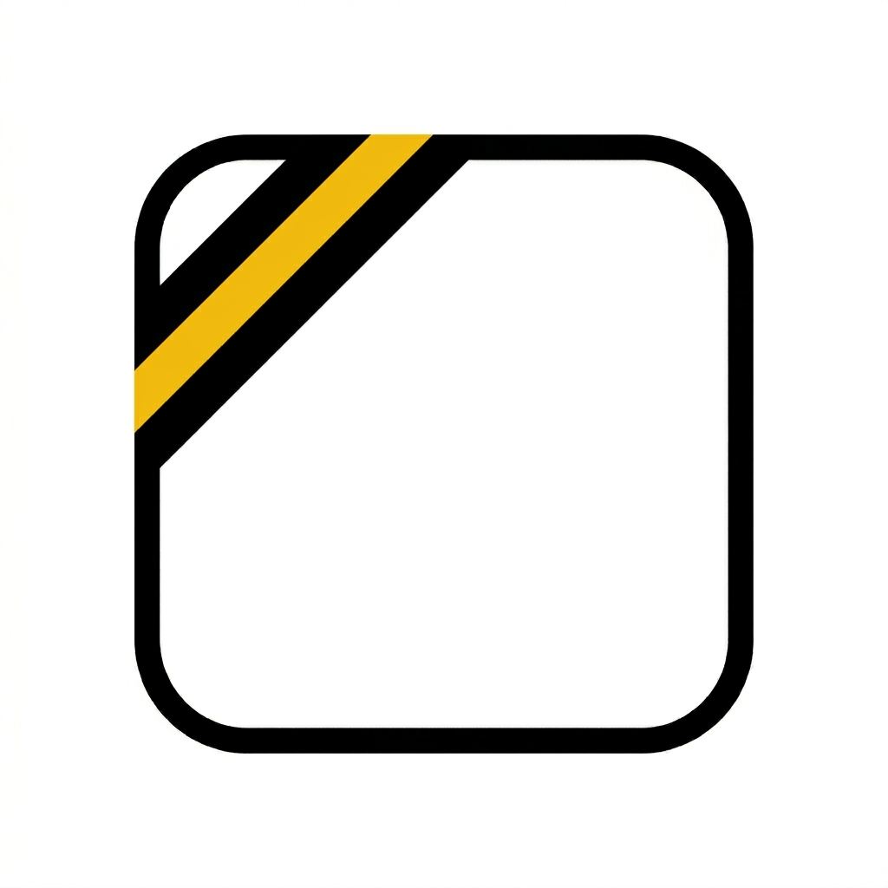
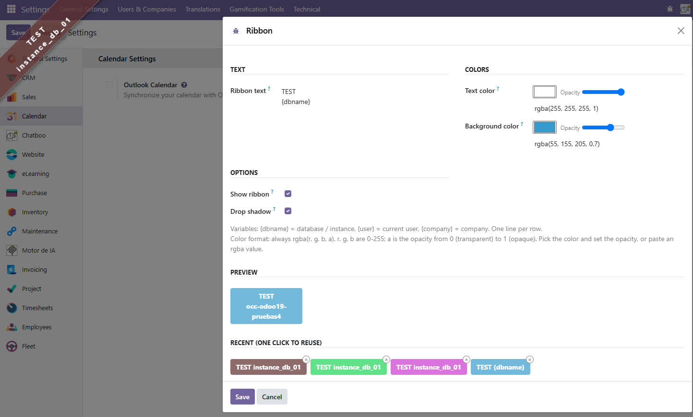

<p align="center">
  
</p>

<h1 align="center">PNS Ribbon</h1>

<p align="center">
  <strong>Visual environment ribbon for Odoo — never confuse production with staging again.</strong>
</p>

<p align="center">
  
  
  
</p>

---

A lightweight Odoo module that displays a **configurable diagonal ribbon** in the corner of the backend to clearly identify non-production instances (TEST, DEV, STAGING, etc.).

Unlike other ribbon modules, PNS Ribbon is **immune to Odoo frontend changes** between versions — it injects vanilla JS/CSS directly into the `<head>`, bypassing the asset bundler entirely.

<p align="center">
  
</p>

## ✨ Features

| Feature | Description |
|:---|:---|
| 🎨 **Color picker + opacity** | Native `<input type="color">` with synchronized opacity slider and pasteable `rgba(...)` field |
| 👁️ **Live preview** | See the final ribbon look while editing, before saving |
| 📋 **History grid** | Last 20 color combinations as clickable cards — one click to reuse, × to remove |
| ⚙️ **On/off switch** | Hide the ribbon without uninstalling (`pns_ribbon.enabled = 0`) |
| 🎭 **Shadow toggle** | Remove the drop shadow for a flatter, more discreet look |
| 📐 **Variables** | `{dbname}`, `{user}`, `{company}` — replaced at render time |
| 🔄 **Multi-line text** | One line per row, stored as `<br>`-joined HTML |
| 🛡️ **Bundler-proof** | No `odoo.define`, no OWL, no jQuery in the ribbon itself |

## 📦 Installation

Each branch in this repository contains a **ready-to-install module** for a specific Odoo version. Pick the branch that matches your Odoo:

| Odoo version | Branch |
|:---|:---|
| 13 | `13.0` |
| 14 | `14.0` |
| 15 | `15.0` |
| 16 | `16.0` |
| 17 | `17.0` |
| 18 | `18.0` |
| 19+ | `19.0` |

### Option A: git clone (recommended)

```bash
# Clone the branch for your Odoo version (example: Odoo 17):
git clone -b 17.0 https://github.com/patanegra/pns_ribbon.git /path/to/addons/pns_ribbon

# Restart Odoo, update the app list, and install PNS Ribbon from Settings > Apps.
```

### Option B: Download ZIP

1. On this page, select your Odoo version from the **branch dropdown** (top-left).
2. Click **Code → Download ZIP**.
3. Extract into your Odoo addons path.
4. Restart Odoo and install from *Settings > Apps*.

## ⚙️ Configuration

### Wizard (recommended)

Open **Settings > Technical > Ribbon** (administrators only).

- **Text** — one line per row. Supports variables (see below).
- **Text color / Background color** — pick with the color wheel, adjust opacity with the slider, or paste an `rgba(r, g, b, a)` value directly.
- **Preview** — shows the final look in real time.
- **Recent** — grid of the last 20 saved color combinations. Click to reuse, × to delete.

### Variables

| Variable | Replaced with |
|:---|:---|
| `{dbname}` or `{db_name}` | Database / instance name |
| `{user}` | Current user's display name |
| `{company}` | Current company's name |

### System Parameters (advanced)

You can also edit the raw values via *Settings > Technical > Parameters > System Parameters*:

| Parameter | Description | Example |
|:---|:---|:---|
| `pns_ribbon.html` | Ribbon text (`<br>` for line breaks) | `TEST<br>{dbname}` |
| `pns_ribbon.textColor` | Text color | `rgba(255, 255, 255, 1)` |
| `pns_ribbon.backgroundColor` | Background color | `rgba(255, 0, 0, 0.5)` |
| `pns_ribbon.enabled` | Master switch (`0` = hidden) | `1` |
| `pns_ribbon.shadow` | Drop shadow (`0` = flat) | `1` |

## 🏗️ Architecture

The module is designed to be **version-proof**:

- **Ribbon injection** — inherits `web.layout` and injects a `<script>` + `<link>` into `<head>`. `ribbon.js` (vanilla IIFE, no framework) creates a `<div id="pns-ribbon">` at runtime. `ribbon.css` styles it.
- **Data delivery** — server-rendered `window.pns_ribbon_data` object in the `<head>`, no RPC calls needed.
- **Config wizard** — a plain `TransientModel` form with `onchange` preview.
- **Cache-busting** — static files are loaded with `?v=<module_version>` to force browser refresh after upgrades.

## 🔄 Migrating from `web_environment_ribbon` (OCA)

PNS Ribbon is a **completely independent implementation** — it does not share any code with the OCA module. It uses its own parameter namespace (`pns_ribbon.*` vs `ribbon.*`), so both modules can coexist safely.

If you want to migrate your existing configuration:

```python
# One-time migration script (run in Odoo shell)
icp = env['ir.config_parameter'].sudo()
old_name = icp.get_param('ribbon.name', '')
old_color = icp.get_param('ribbon.color', '')
old_bg = icp.get_param('ribbon.background.color', '')

if old_name:
    icp.set_param('pns_ribbon.html', old_name.replace('{db_name}', '{dbname}'))
if old_color:
    icp.set_param('pns_ribbon.textColor', old_color)
if old_bg:
    icp.set_param('pns_ribbon.backgroundColor', old_bg)
```

## 📄 License

[Apache License 2.0](LICENSE) — © 2025 [PATANEGRA Soft](https://patanegra.com)

## 🤝 Contributing

See [CONTRIBUTING.md](CONTRIBUTING.md).
